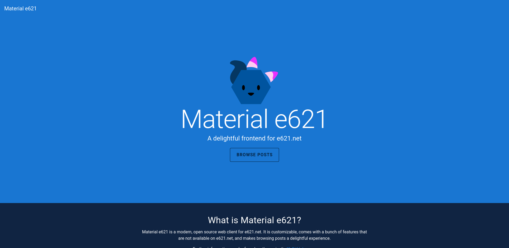
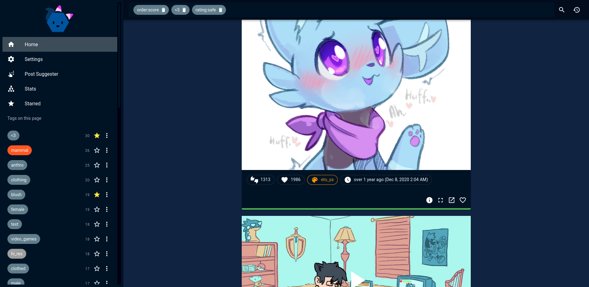
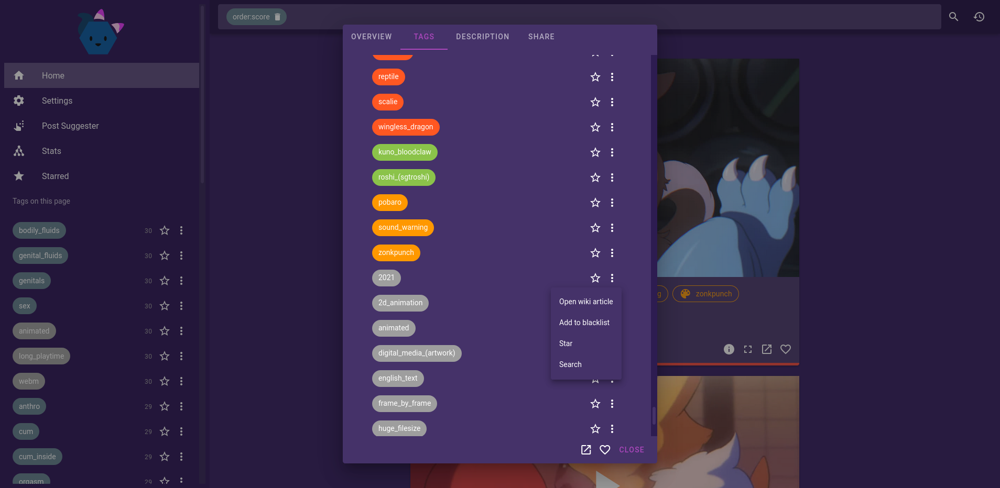
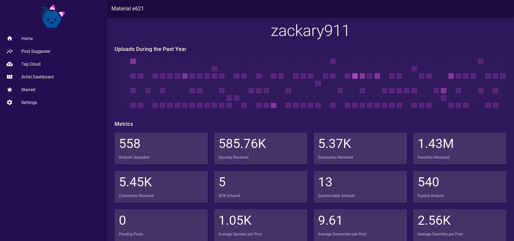
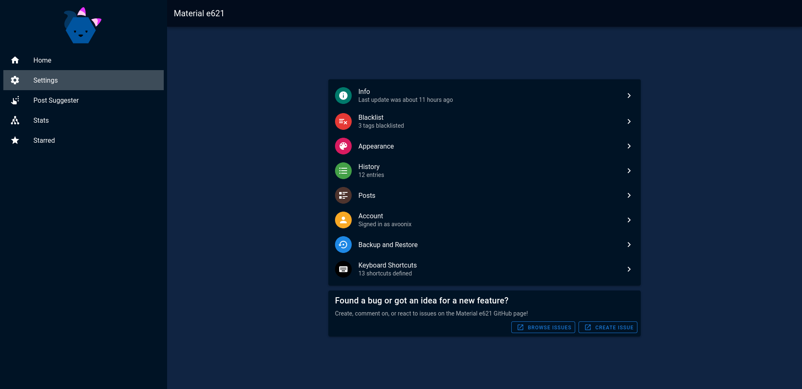
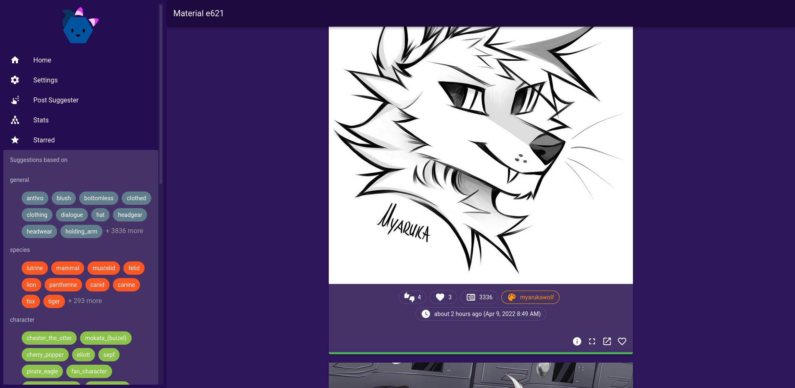
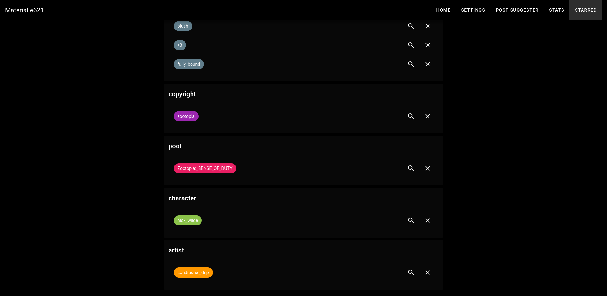

# Material e621

> Material e621 is a modern, open source web client for e621.net. It is customizable, comes with a bunch of additional features that are not available on e621.net, and makes browsing posts a delightful experience.

## Screenshot Gallery

[](https://material-e621.vercel.app/)

[](https://material-e621.vercel.app/)

[](https://material-e621.vercel.app/)

[](https://material-e621.vercel.app/)

[](https://material-e621.vercel.app/)

[](https://material-e621.vercel.app/)

[](https://material-e621.vercel.app/)

## Usage

### Hosted

Latest version is available on [Vercel](https://material-e621.vercel.app/).

### Docker

```bash
sudo docker run -d -p 8080:80 ghcr.io/avoonix/material-e621:latest
```

Alternatively, you can use `docker-compose up` with this [docker-compose.yml](./docker-compose.yml). Alternative docker compose setups and dockerfiles can be found in [#3](https://github.com/avoonix/material-e621/issues/3) and [#13](https://github.com/avoonix/material-e621/issues/13).

`latest` can be replaced with any of the [available versions](https://github.com/avoonix/material-e621/pkgs/container/material-e621/versions)

### Development

```bash
pnpm install
pnpm run dev
```

```bash
pnpx playwright test
pnpx playwright test --debug
pnpx playwright codegen
```

Or, to build the desktop app:

Install the dependencies:

`rust/cargo`:
<details>
  <summary>Linux</summary>
  
  Use the package manager that comes with your distro
</details>
<details>
  <summary>Windows</summary>
  Download and run the rust installer
</details>

`nodejs/pnpm`:
<details>
  <summary>Linux</summary>

  Use the package manager that comes with your distro
</details>

<details>
  <summary>Windows</summary>

  Download the installer from the NodeJS website
</details>

Then run:
```bash
pnpm install
cargo install tauri-cli
cargo tauri build
```
