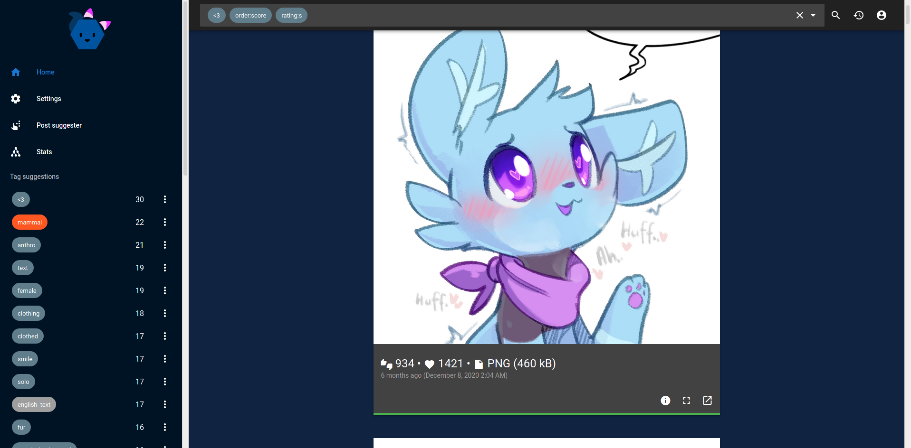

# Material e621



https://e621.net/forum_topics/29483

## Usage

### Hosted

Latest version (`master`) hosted on [Vercel](https://material-e621.vercel.app/). 

<!-- `dev` version [here](https://material-e621-git-dev-avoonix.vercel.app/) - mainly for testing, might not work at all. -->

### Local

```bash
npm install
npm run build
```

Serve the contents of `dist` on a http server. ([handy list](https://gist.github.com/willurd/5720255))

<!-- ## Some goals

- rewrite everything using typescript, vue3 function api and vuetify 3; with more focus on performance (than the previous version)
- more customizability, re-add features removed during rewriting
- create a desktop application -->

<!-- [Configuration Reference](https://cli.vuejs.org/config/) -->
